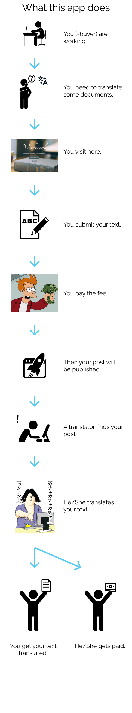
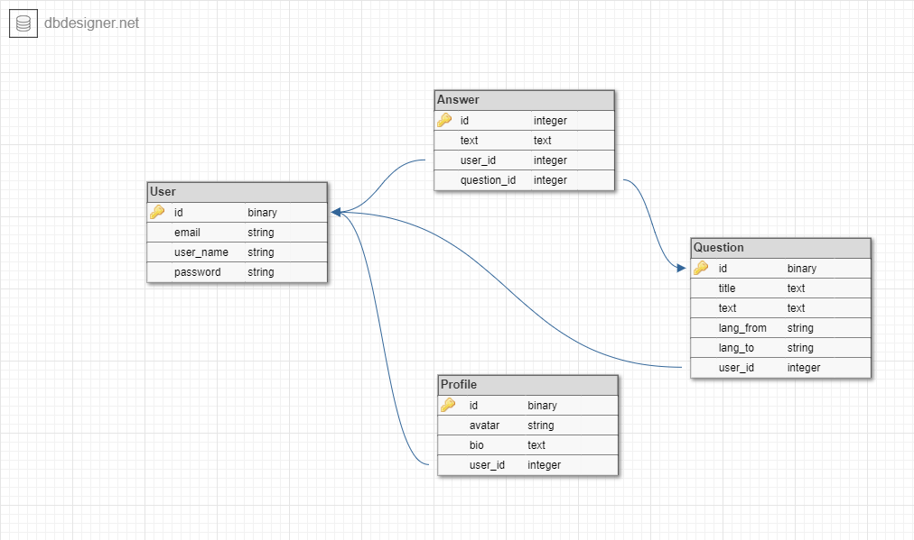

# Two-sided Marketplace - Office documents translation portal

So for my Rails app project I have decided to create a two-sided marketplace between office workers and freelance (or aspiring) translators.

Why?

Because this is based on my work experience where I was paid to translate some documents from Japanese to English for business purposes. 
Although I am not a professional translator, I was actually enjoying the task (in fact I once thought of becoming a translator) so I thought it would be good if there is a portal for business people who need decent translations and translators who want to earn some.

## User story

## Framework
The one with yellow background, I personally prefer this but it did not give much sense of formality so had to ditch it.
Then I got inspiration from old-fashioned dictionaries so fonts are all serif, the colour scheme is deep green with touch of yellow (like cover, you know).  
For font pairing, I was first to mix serif and sans-serif but sans-serif just didn't feel right, so I went for calligraphy (logo - Tangerine) and serif (body - Vollkorn).

## ERD

I found this service called SmartDraw which in my opinion better visualised than DBdesigner.

## Gems used
- Bootstrap
- Devise
- Shrine and its dependencies
- Dotenv
- Stripe
- Rspec
- Mailgun
- Ransack

## Struggles and lessons learnt
### Shrine!!! 
- Upload failed all the time. It took me several days to investigate the cause and finally discovered that it had to do with JPG's image resizing error with Shrine's dependencies (ImageMagick I think, it wasn't even Shrine's fault after all).
- Although now I know where the error comes from and it is to do with the discrepancies in build version, I wasn't able to fix it.
- So I disabled resizing function for a temporary fix. At least I made it work!

### I thought I had planned well.
- I was first thinking of Stack Overflow kind of portal where a question can have multiple answers, however the more I work on it the clearer it became that this is not going to work out as I planned.
- To be specific, I was stuck where to implement payment system. My initial idea was something like you need to pay if you post more than certain amount of times.
- However when I considered a two-sided marketplace, I was thinking to myself "Would translators be benefitted by this model when they're doing it for free? Is this even a two-sided market? Would I sign up as a translator?"
- Answer to all the questsions were NO. 
- So I changed my direction to be more of AirTasker.
- Thus I had to redesign my framework of course, and re-write hundreds of codes which I spent hell a lot of hours on. Learning opportunity yay.

## Challenges
### My introversion.
- When I got stuck, I spent too many hours solving it myself when all I had to do is just ask.
- I was hesitant because I wasn't sure if I can explain my situation and problem.
- I don't think it's a good practice because that's how you actually update your progress with others (and not leaving them wondering what on earth I've been up to).

### Re-modelling to suit my capability.
- Not always what I pictured took place because of my technical capability.
- Especially integration of payment system with Stripe. Had so much 'fun' figuring out how to pass `params`.
- So I spent so many hours to settle in where things still make sense and the level I feel I can accomplish.
- I gave up implementing function where it redirects back to `post` page after the payment is made via Stripe.
- In the end I added `true`/`false` column to the databae and restrict some actions based on the boolean. (ie your post won't be published unless you pay.) 

# https://wordsworth.herokuapp.com/
